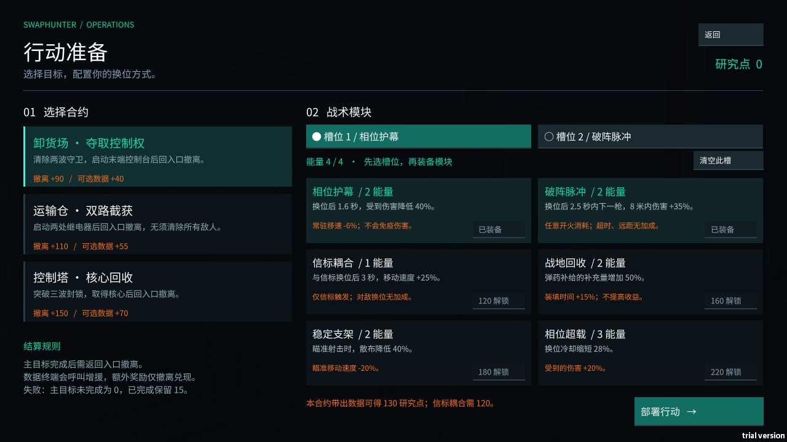
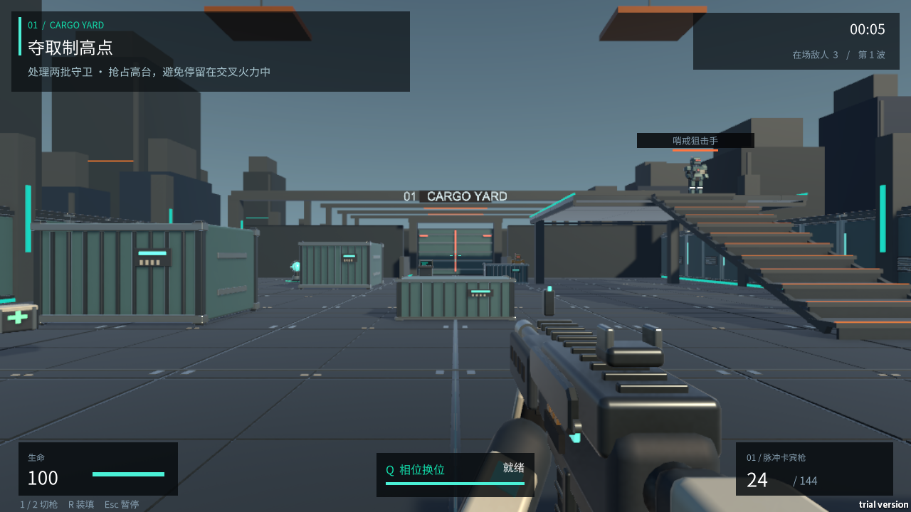

# SwapHunter · 换位猎手

以空间换位为核心机制的 Unity 单人战术 FPS 原型，也是一个系统策划作品集项目。

玩家与敌人或相位信标交换位置，利用高低差、掩体、敌方手雷和短暂攻击窗口完成目标。合约玩法把战斗连接到战术装配、风险选择、撤离结算与横向解锁。



## 玩法与系统

- 双向换位：视线、距离、双方落点、附属盾牌碰撞及导航条件检查；不交换朝向、生命或弹药。
- 两种武器与多类机器人：卡宾枪、霰弹枪、突击兵、狙击手、盾卫和指挥官。
- 三份合约：卸货场控制权、运输仓继电器、控制塔核心回收。
- 六种战术模块：两槽、四能量预算，收益与代价由配置表驱动。
- 风险收益：可选数据终端呼叫增援，成功撤离才兑现额外收益。
- 成长与存档：研究点解锁模块、一次性结算收据、原子保存、备份恢复和中断补偿。
- 基础教学、完整战役、自由试招及可重绑的键鼠设置。



## 盾兵的应对方式

盾牌本身完全挡弹且不可击碎，暴露的身体可以正常受伤。绕到侧背面射击，或按换位键交换位置后转身攻击；换位不会自动改变视角朝向。命中盾牌时会显示独立的格挡提示，避免与有效伤害混淆。v0.3.1 修复了普通盾兵身体因同名对象被误判为盾牌的问题。

## 打开工程

1. 安装 **Unity 6000.3.25f1 LTS** 和 Windows 构建支持。
2. 在 Unity Hub 中添加并打开 `Game/`，等待 Package Manager 导入锁定依赖。
3. 打开 `Game/Assets/_SwapHunter/Scenes/SwapHunter.unity`，点击 Play。

地图在运行时生成；编辑模式中的启动场景不是最终完整地图。所需 GLB、字体及原创建模源码已包含在仓库中，日常打开工程不需要先运行 Node.js。

默认操作：WASD 移动，鼠标观察，左键开火，右键瞄准，Shift 冲刺，Alt 慢走，Space 跳跃，Q 换位，R 装填，E 交互，1/2 或滚轮切枪，Esc 暂停。

## 构建与验证

PowerShell 中指定本机 Unity 编辑器路径：

```powershell
./Tools/Build-Demo-v03.ps1 -EditorPath 'C:\Program Files\Unity\Hub\Editor\6000.3.25f1\Editor\Unity.exe'
./Tools/Build-Demo-v03.ps1 -EditorPath '<Unity.exe完整路径>' -RunQA
```

也可以设置 `SWAPHUNTER_UNITY_EDITOR` 环境变量。输出位于 `Builds/SwapHunter-v0.3/`，不提交构建产物和 Unity 缓存。

其他原生验证入口：

```powershell
./Builds/SwapHunter-v0.3/SwapHunter.exe -swapHunterCampaignQA -qaOutput ./Logs/CampaignQA
./Builds/SwapHunter-v0.3/SwapHunter.exe -swapHunterAVReview -qaOutput ./Logs/AVReview
```

验证模式将设置、日志与成长数据隔离，测试检查点保存在进程内存。普通游戏沿用自身的持久化目录。

## 原创建模

```powershell
cd Tools/ArtAuthoring
npm ci --ignore-scripts
npm run build
```

使用 Three.js 0.186.1 和 GLTFExporter 生成 GLB，再经 Unity glTFast 导入。保留 `.meta` 文件以维持资源引用。视觉模型与玩法碰撞体分离。

## 项目结构

| 目录 | 内容 |
|---|---|
| `Game/Assets/_SwapHunter/Scripts` | 玩法、UI、存档、验证与构建代码 |
| `Game/Assets/_SwapHunter/Resources/CampaignCatalog.json` | 模块与合约运行配置 |
| `Game/Assets/_SwapHunter/Art/ThreeModels` | 原创 GLB 模型与导出统计 |
| `Tools/ArtAuthoring` | Three.js 建模生成器及锁定依赖 |
| `docs/system-design-v03.md` | 系统规则、数值与设计取舍 |
| `docs/validation.md` | 已验证范围和当前限制 |

## 状态与贡献

当前为 v0.3.1 原型，持续进行体验评审。代码、程序化美术及测试使用 AI 辅助制作；自动检查和 AI 评审不等于真人试玩。验证结果及边界见 [验证说明](docs/validation.md)。

## 许可

项目原创代码、文档、模型和合成音效采用 [MIT](LICENSE)。第三方字体、Unity 软件包及其他第三方内容保留各自许可，详见 [第三方声明](THIRD_PARTY_NOTICES.md)。Unity Editor 和软件包缓存不随本仓库分发。

